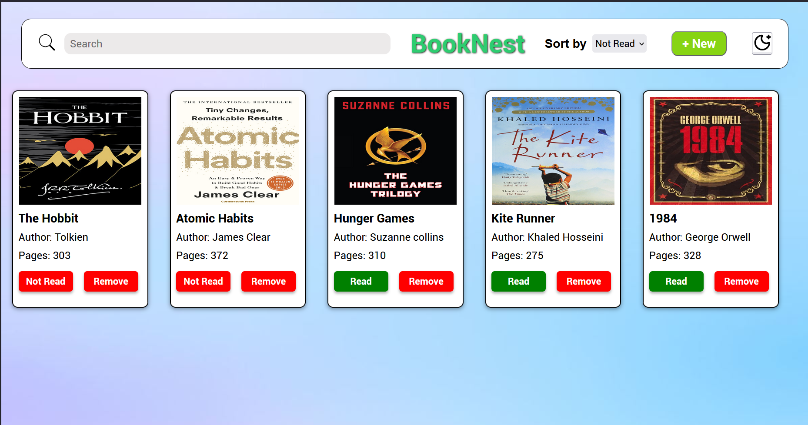
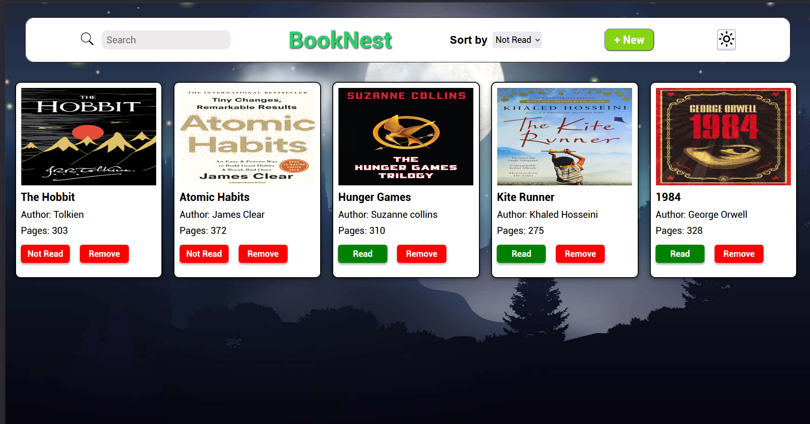

## 📚 BookNest – Personal Library Manager

A simple library web app where you can add, search, and manage your books. Built with HTML, CSS, and JavaScript.

## ✨ Features

- ➕ Add new books with title, author, pages, read status, and cover image.

- 🔍 Search functionality – filter books by title or author.

- 🌙 Dark/Light mode toggle.

- 🗑️ Remove books easily.

- 📱 Responsive design – works on desktop and mobile.

## 🚀 Demo
👉 Live Demo (https://book-nest-navy.vercel.app/)

## 🛠️ Tech Stack
- HTML5 – structure

- CSS3 – styling + responsiveness

- JavaScript (ES6+) – app logic (add/remove/search books, toggle dark mode)

## 📸 Screenshots  

### 🔆 Light Mode  
  

### 🌙 Dark Mode  
  

Inspired by The Odin Project
